# **Transformers Battle Simulator - AYED TPG 2C2024**

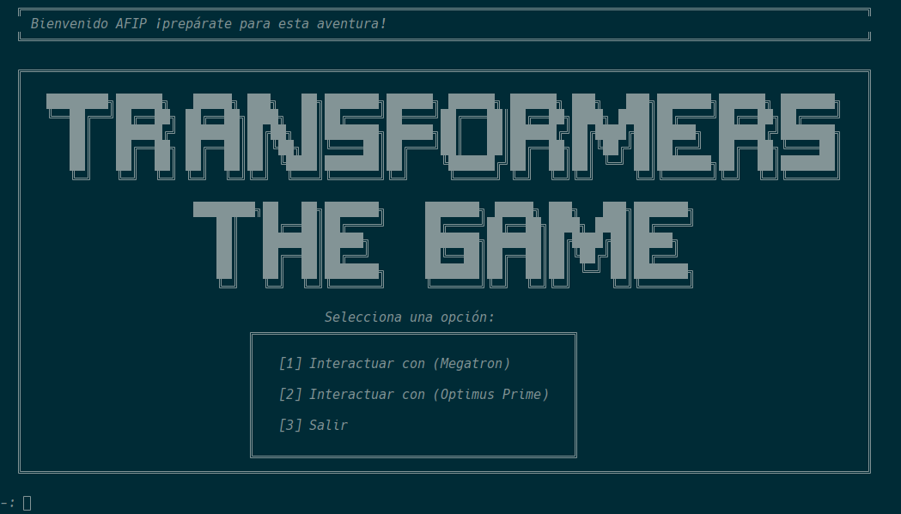

---  

Este proyecto es una simulación estratégica de batalla basada en **Transformers**, desarrollada como parte del trabajo práctico grupal de la materia **Algoritmos y Estructuras de Datos (AYED)**.  

#### **📌 Características principales:**  
- Implementación de estructuras de datos eficientes, incluyendo **grafos, colas de prioridad y vectores**.  
- Uso del **algoritmo de Dijkstra** para encontrar el camino óptimo en la simulación de batalla.  
- Administración de **Transformers y cristales**, con mecánicas de equipamiento, almacenamiento y fusión.  
- Interacción con personajes icónicos como **Optimus Prime y Megatron**.  
- Diferentes tipos de vehículos con estadísticas balanceadas.  
- **CMake y compilación manual** para facilitar la ejecución del código.  

#### **📂 Contenidos del repositorio:**  
- Código fuente en **C++**, estructurado en módulos.  
- **Informe de complejidad algorítmica** detallado.  
- Capturas de pantalla del juego y sus menús.  

#### **⚙️ Compilación:**  
Puedes compilar el proyecto con:  
```bash
g++ -I include src/Grafo/*.cpp src/*.cpp main.cpp -o main
```  
O usar **CMake** con el archivo `CMakeLists.txt`.  

## Authors

- [@SILVA GUILLERMO ANDRES](https://www.github.com/guillsil)
- [@RIVERO ARDISSONE CANDELA BELÉN](https://www.github.com/CandelaRiveroA)
- [@FARIÑA GONCALVES ALEX JAVIER](https://www.github.com/AlexFari2004)
- [@NARVÁEZ YAGUANA GABRIEL ALEJANDRO](https://www.github.com/Gabosawn)

### Menú de Administrador Transformers

 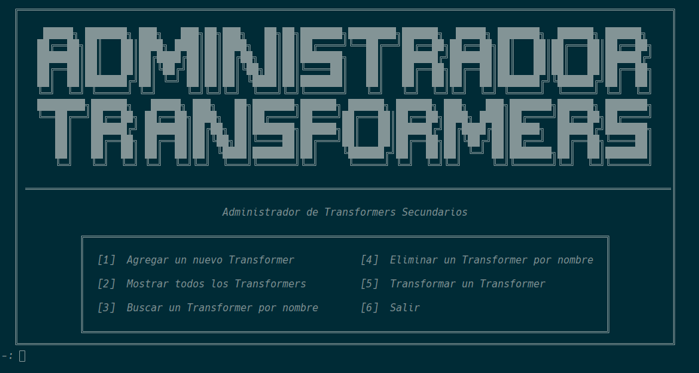 

| Escoger Facción                                                                  | Pedir Nombre Transformers                                  |
|----------------------------------------------------------------------------------|------------------------------------------------------------|
|  | 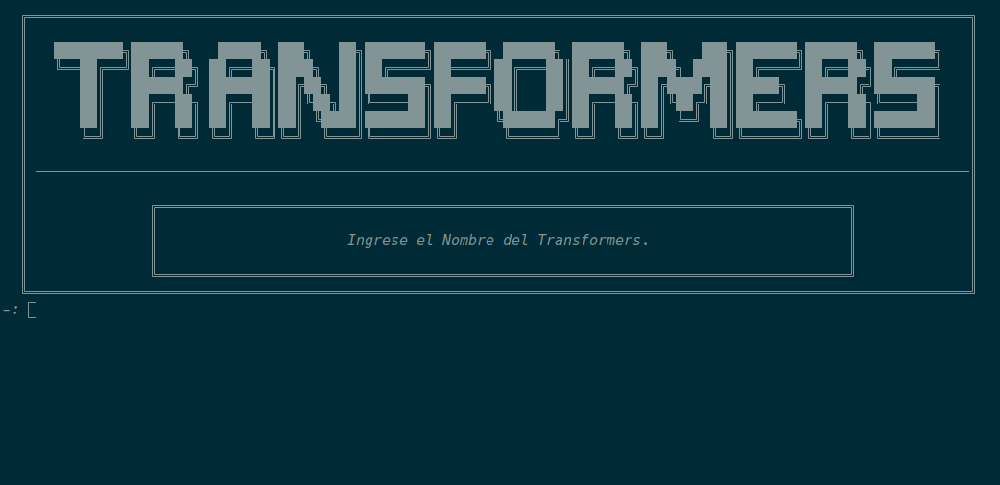 |

| Escoger Vehiculo                                                              | Escoger Aeronave                                                               |
|-------------------------------------------------------------------------------|--------------------------------------------------------------------------------|
| 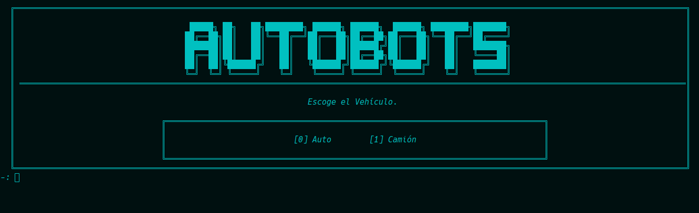 | 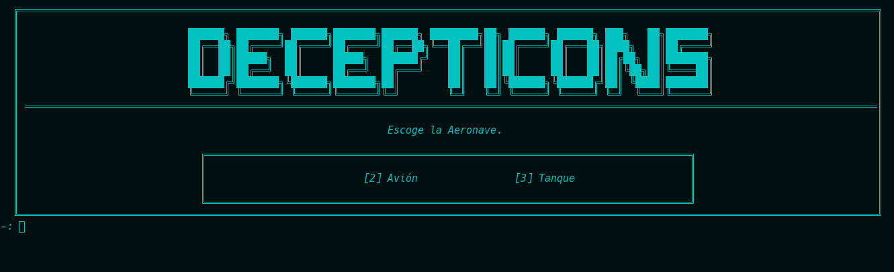 |
### Tabla de clasificación y Simulador de Batalla


| Tabla De Clasificaión                                                                    | Simulador de batalla                                                          |
|------------------------------------------------------------------------------------------|-------------------------------------------------------------------------------|
| 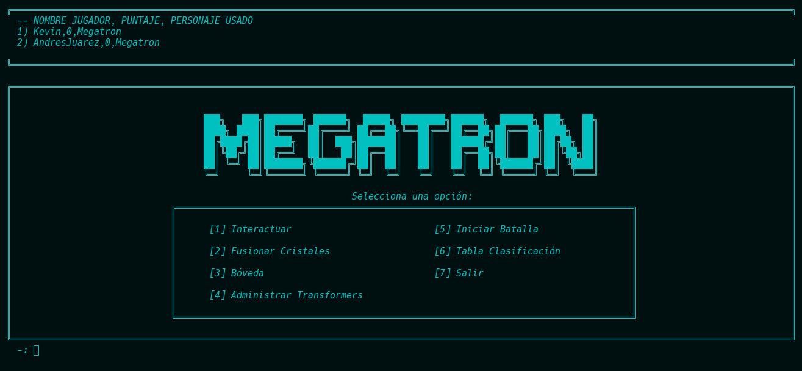 |  |

### Menú de Nuevas Funcionalidades (Fusiondor - Boveda)
| Menu Bóveda                                                               | Menu Fusionador                                                               |
|---------------------------------------------------------------------------|-------------------------------------------------------------------------------|
| 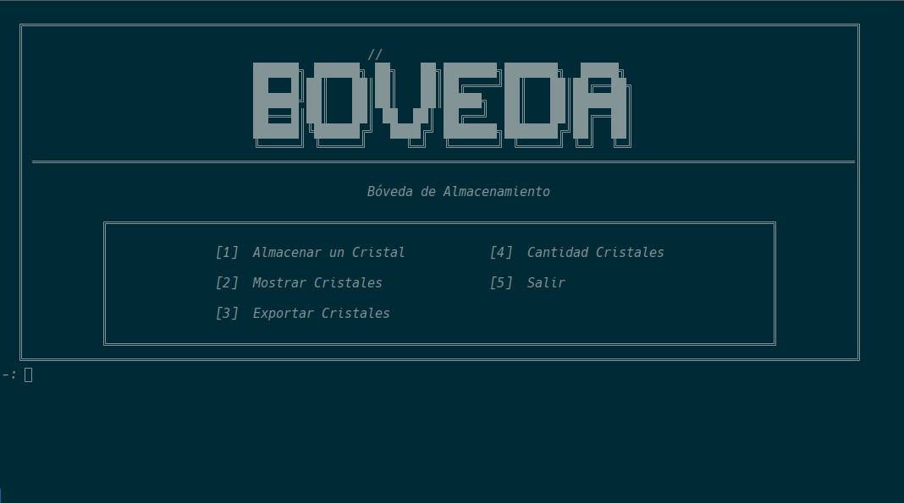 | 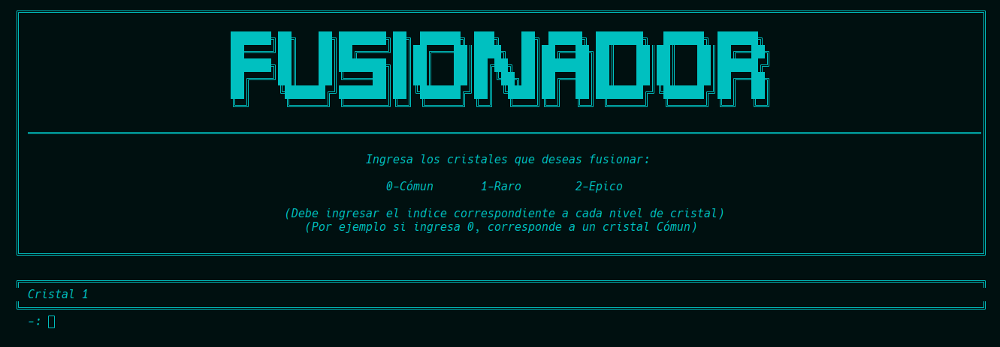 |

### Menú para interactuar con Megatron y Optimus
| Interactuar con Megatron                                                            | Interactuar con Optimus                                                            |
|-------------------------------------------------------------------------------------|------------------------------------------------------------------------------------|
| 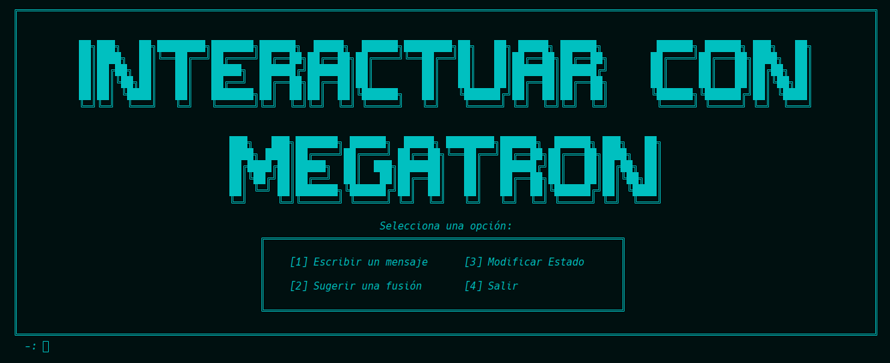 | 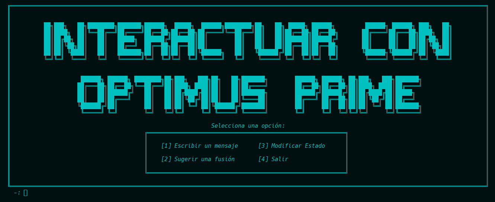 |
### Menú de la Bóveda
| Menu Bóveda para Almacenar                                                          | Menu Bóveda para Exportar                                                          |
|-------------------------------------------------------------------------------------|------------------------------------------------------------------------------------|
| 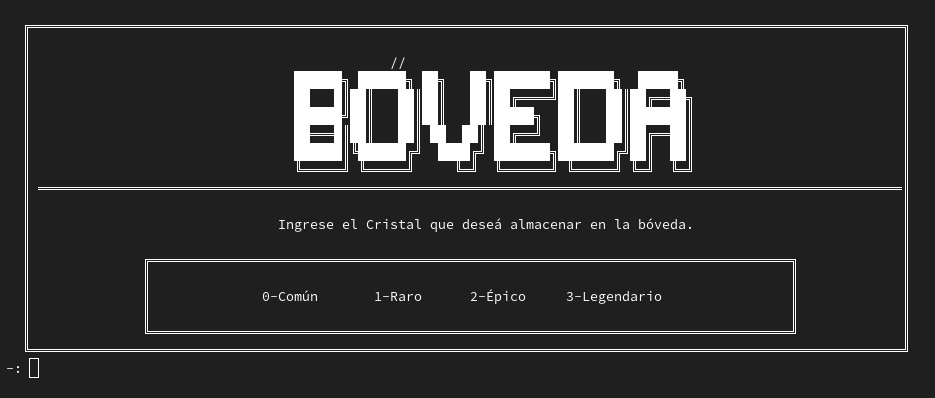 | 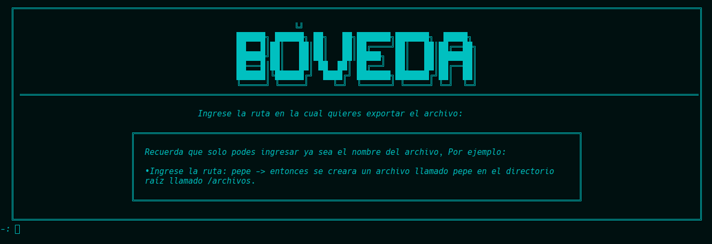 |
### Menú de Personajes
| Menu Personaje Optimus                                                     | Menu Personaje Megatron                                                     |
|----------------------------------------------------------------------------|-----------------------------------------------------------------------------|
| 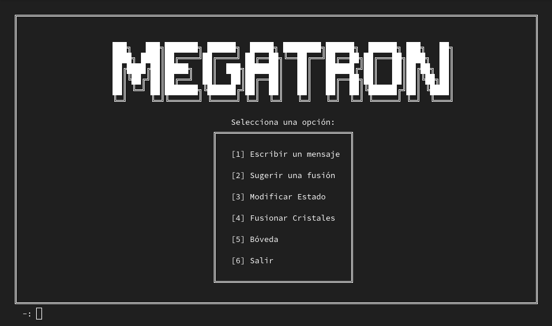 | 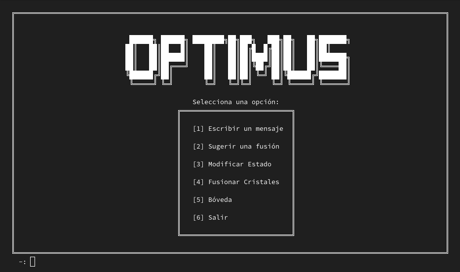 |

### Menú para elegir el estado y Hacer Pregunta
| Elegir Estados para Optimus                                                         | Hacer una pregunta                                                                  |
|-------------------------------------------------------------------------------------|-------------------------------------------------------------------------------------|
| 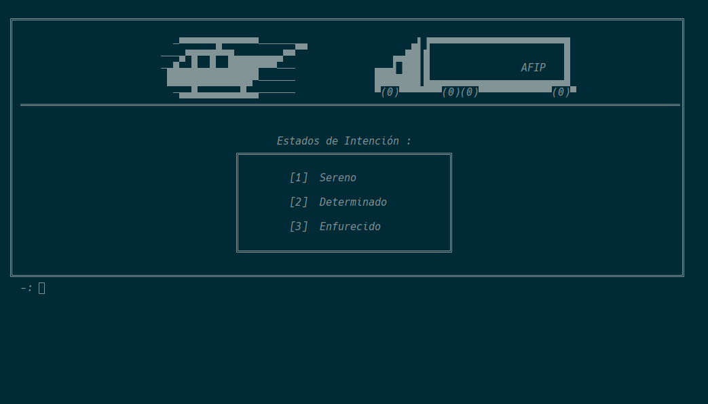 |  |


### Respuestas que se da a distintos cambios
| Sugerir Fusion                                                                           | Respuesta a mensaje                                                                |
|------------------------------------------------------------------------------------------|------------------------------------------------------------------------------------|
|            | 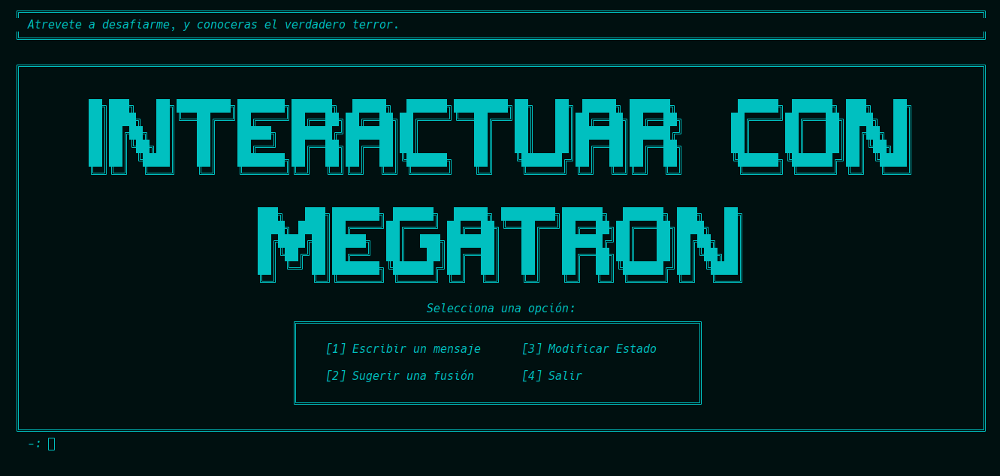    |
| Modificar Estado                                                                         | Resultado de Fusionar                                                              |
| 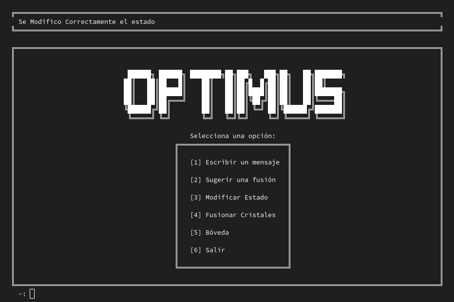 | 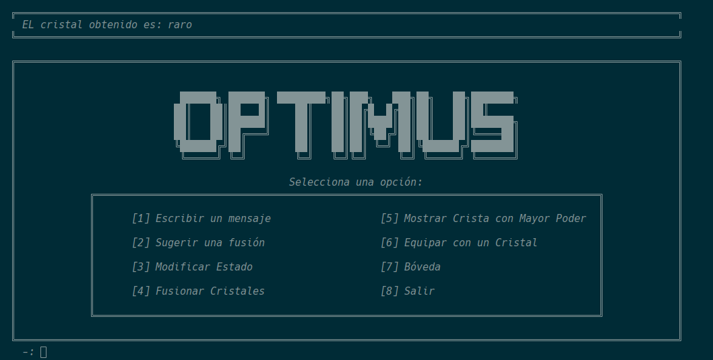 |


