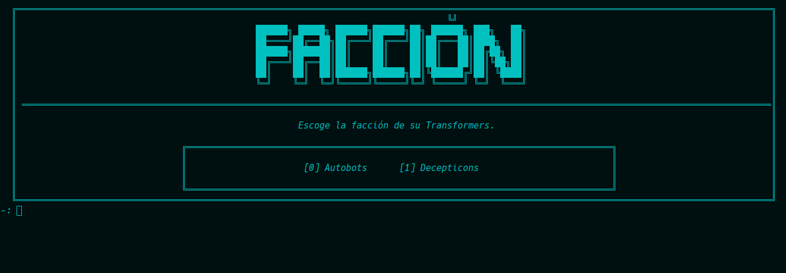
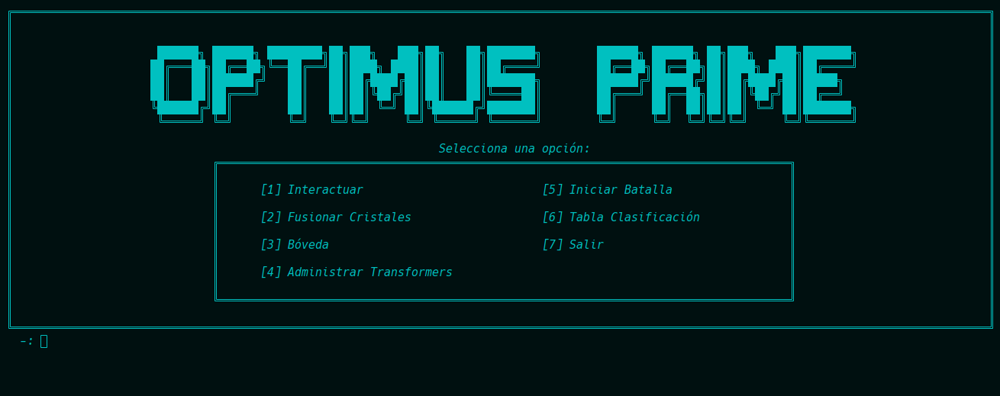

[](https://classroom.github.com/a/SOoPfuVL)
# AYED - TPG 2c2024

## Authors

- [@SILVA GUILLERMO ANDRES - 109777](https://www.github.com/guillsil)
- [@RIVERO ARDISSONE CANDELA BELÉN - 110339](https://www.github.com/CandelaRiveroA)
- [@FARIÑA GONCALVES ALEX JAVIER  - 112438](https://www.github.com/AlexFari2004)
- [@NARVÁEZ YAGUANA GABRIEL ALEJANDRO - 111432](https://www.github.com/Gabosawn)


## Compilación

El proyecto se puede compilar manualmente por terminal con la siguiente línea:

```bash
g++ -I include src/Grafo/*.cpp src/*.cpp main.cpp -o main
```

O, alternativamente, con CMake, utilizando el archivo **CMakeLists.txt** presente en el directorio raíz.

## Informe de complejidad algorítmica

[Informe de complejidad algorítmica](./Informe_complejidad_algoritmica.md)


## Justificación de la Selección de Estructuras de Datos y Algoritmos.

* ### Cola de Prioridad en el Algoritmo de Camino Mínimo de Dijkstra
  * El uso de un ***heap*** en ***Dijkstra*** permite que el algoritmo sea mucho más eficiente al seleccionar rápidamente el nodo con menor distancia, mantener actualizadas las prioridades, y evitar exploraciones innecesarias. Esto asegura un rendimiento óptimo, especialmente en grafos grandes o densos.
  * En pocas palabras: En Dijkstra, nos asegura encontrar el camino más corto de manera eficiente, reduciendo la complejidad a ***O((a + v)log(v))***.


* ### Uso de un vector para alamcenar los Transformers Secundarios
  * Se emplea el ***TDA Vector*** para manejar la lista de transformers debido a su flexibilidad y eficiencia en operaciones comunes como insertar, búsqueda y eliminación. Al ser dinámico, el vector permite ajustar el tamaño según sea necesario, mientras mantiene un rendimiento óptimo para gestionar y mostrar la lista de manera ordenada. Esto facilita la implementación de funcionalidades como agregar, buscar o eliminar transformers de forma sencilla y eficaz.

* ### Grafos en la generación de Combates
  * Elegimos usar un grafo para representar el mapa de batalla en nuestro juego porque ofrece una estructura flexible y dinámica ideal para simular el avance estratégico del personaje. 
  * En el grafo, cada nodo representa un punto en el mapa y cada arista una conexión posible, permitiendo así la búsqueda de rutas óptimas para que el personaje se desplace hacia sus objetivos. Además, el grafo maneja de forma eficiente las interacciones del personaje con rivales de diferentes facciones, permitiendo saltar o enfrentar enemigos. 
  * También facilita la modularidad y escalabilidad del mapa, añadiendo y eliminando puntos de batalla fácilmente para adaptarse a diferentes niveles y escenarios. 

* ### Dijkstra para obtener el camino Minimo en la Simulacion de la batalla
  *  Usamos el algoritmo de camino mínimo de ***Dijkstra*** en la simulación de batalla porque es altamente eficiente para encontrar la ruta más corta en un grafo, lo cual es esencial para el desplazamiento estratégico del personaje en el mapa de batalla. 
  * Una vez generado el mapa, Dijkstra permite identificar el camino mínimo entre el personaje y su objetivo rápidamente. Esto asegura que el personaje pueda avanzar de manera óptima.

## Aclaraciones Adicionales
* ### Obsequio de un Cristal al Iniciar el juego
  * Al iniciarse el juego se obsequiará un cristal de rareza común al jugador 

* ### Parámetro Poder
  * El parámetro de poder de un cristal se representa mediante la suma de las estadísticas de un cristal es decir es la suma entre la fuerza, defensa y velociad.

* ### Como se muestra el cristal con mayor Poder
  * Para poder mostrar el cristal con mayor poder lo que se decide es ir almacenando en la bóveda los cristales de manera ordenada (****Inserción Ordenada***) y asi el obtener el cristal de mayor poder tendrá un costo de ***O(1)***, esto porque se ordena de manera descendente lo que permite obtenerlo de una manera más rápida, ya que está en la primera posición.

* ### Como se Equipa un Cristal al Personaje
  * Para poder equipar con un cristal al personaje lo que se decidió es crearle una bóveda de cristales al personaje en la cual el mismo solo podrá equiparse con hasta ***7 cristales***.
  * Siempre se equipara con el cristal de mayor poder.

* ### Estadisticas con la que se crearan los Transformers
  * A la hora de crear los transformers lo que opto por hacer es que todos tengas un máximo de hasta ***300*** de estadísticas sumadas entre cada una de ellas.
  * También que todos los transformers creado desde el Administrador de Transformers se creen sin transformar.
  * La division para cada uno de los transformers es la siguiente:
    * ***Auto:*** fuerza: 50; defensa: 60; velocidad: 100. 
    * ***Camion:*** fuerza: 120; defensa: 80; velocidad: 60.
    * ***Avion:*** fuerza: 60; defensa: 50; velocidad: 100.
    * ***Tanque:*** fuerza: 90; defensa: 110; velocidad: 30.

* ### Estadisticas de Optimus y Megatron
  * Para las estadísticas de los protagonistas del juego lo inicilaizamos de la siguiente manera:
    *  ***Megatron***: fuerza: 60, defensa: 70, velocidad: 90.
    *  ***Optimus***: fuerza: 70, defensa: 90, velocidad: 50.


## Screenshots

### Menú de Administrador Transformers

  

| Escoger Facción                                                                  | Pedir Nombre Transformers                                  |
|----------------------------------------------------------------------------------|------------------------------------------------------------|
|  |  |

| Escoger Vehiculo                                                              | Escoger Aeronave                                                               |
|-------------------------------------------------------------------------------|--------------------------------------------------------------------------------|
|  |  |
### Tabla de clasificación y Simulador de Batalla


| Tabla De Clasificaión                                                                    | Simulador de batalla                                                          |
|------------------------------------------------------------------------------------------|-------------------------------------------------------------------------------|
|  |  |

### Menú de Nuevas Funcionalidades (Fusiondor - Boveda)
| Menu Bóveda                                                               | Menu Fusionador                                                               |
|---------------------------------------------------------------------------|-------------------------------------------------------------------------------|
|  |  |

### Menú para interactuar con Megatron y Optimus
| Interactuar con Megatron                                                            | Interactuar con Optimus                                                            |
|-------------------------------------------------------------------------------------|------------------------------------------------------------------------------------|
|  |  |
### Menú de la Bóveda
| Menu Bóveda para Almacenar                                                          | Menu Bóveda para Exportar                                                          |
|-------------------------------------------------------------------------------------|------------------------------------------------------------------------------------|
|  |  |
### Menú de Personajes
| Menu Personaje Optimus                                                     | Menu Personaje Megatron                                                     |
|----------------------------------------------------------------------------|-----------------------------------------------------------------------------|
|  |  |

### Menú para elegir el estado y Hacer Pregunta
| Elegir Estados para Optimus                                                         | Hacer una pregunta                                                                  |
|-------------------------------------------------------------------------------------|-------------------------------------------------------------------------------------|
|  |  |


### Respuestas que se da a distintos cambios
| Sugerir Fusion                                                                           | Respuesta a mensaje                                                                |
|------------------------------------------------------------------------------------------|------------------------------------------------------------------------------------|
|            |     |
| Modificar Estado                                                                         | Resultado de Fusionar                                                              |
|  |  |


