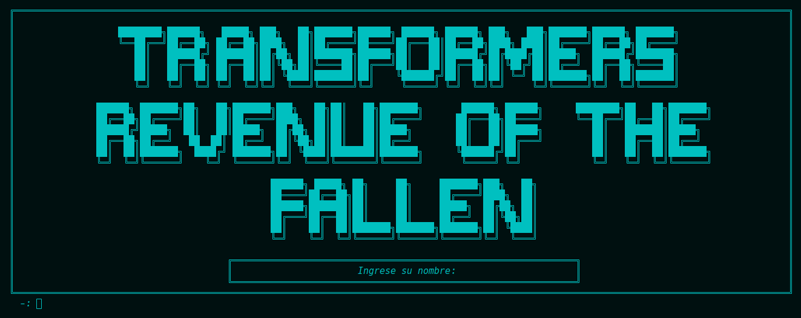
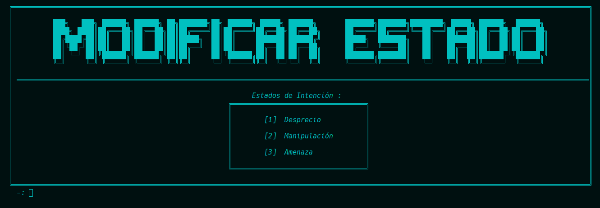
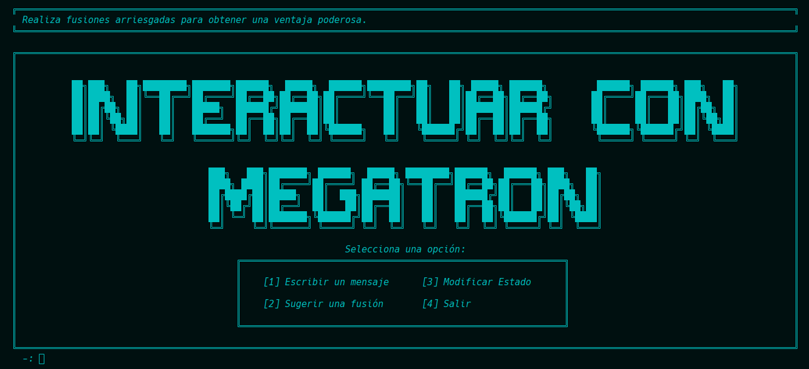

[](https://classroom.github.com/a/SOoPfuVL)
# AYED - TP2 2c2024 - SILVA GUILLERMO ANDRES - 109777

<p align="center">
   <br>
</p>


## Compilación

El proyecto se puede compilar manualmente por terminal con la siguiente línea:

```bash
g++ -I include main.cpp src/*.cpp -o main
```

O, alternativamente, con CMake, utilizando el archivo **CMakeLists.txt** presente en el directorio raíz.

## Aclaraciones adicionales:
* ### Manejo de las Estadisticas de un Cristal:
    * Para las estadísticas de cada cristal opté por crear una Objeto Estadísticas, el mismo se encarga de almacenar los atributos de ***(Fuerza, Defensa y Velocidad)***. También contiene métodos getters para obtener estos parámetros y para poder mostrar todos los atributos. 
    * También contiene un método para ***aplicar_bonificacion*** que básicamente cuando se llama a la misma los atributos ***(Fuerza, Defensa y Velocidad)*** reciben una bonificación es decir aumentarlos un determinado valor que es de ***10 puntos*** extras.

* ### Bonificaciones por Fusiones exitosas:
  * Por cada fusion exitosa que se realize se sumara a un contador dentro del fusionador llamado ***probabilidad_bonificacion*** el mismo tiene un valor base de ***10 puntos***, por cada fusion exitosa se le sumara ***5 puntos*** y se irá acumulando, hasta un máximo de ***40 puntos***, una vez que se alcance el límite se reinicia el contador y empieza con un valor de ***10 puntos*** nuevamente.
  * En el caso de que falle también se le descontara ***5 puntos*** por cada fusion fallida siempre y cuando no sea menor a la ***BONIFICACION_BASE*** que es de ***10 puntos***.
  * Ahora viene lo interesante ***¿Para qué sirve el atributo de probabilidad_bonificacio?***, el mismo sirve para usarse en un método llamado ***dar_bonificacion*** que básicamente recibe como parámetro este atributo y basándonos en el mismo, usa el generador que nos dieron para calcular la probabilidad de éxito de una fusión, que básicamente con base en lo que devuelve el método nos dice si le damos la bonificación en las estadísticas o no.

* ### Constructor del Vector Dinámico con atributo de tamaño inicial:
  *   En la implementación del ***TDA Vector Dinámico***, he decidido agregar un constructor que reciba un atributo con la capacidad_inicial del vector. El usuario será el encargado de escoger un valor con el que quiera que se cree el vector inicial.

  *   Esto en sí también soluciona un requisito que pedía la clase de ***BovedaDeCristales***, ya que la misma necesitaba que la estructura donde escogiera almacenar los cristales no supere el tamaño de 20 cristales, al principio pensé en poner el tamaño inicial que tenía por defecto en mi TDA Vector en 20, y como nunca superaria este tamaño de 20, jamás se redimensionara y como siempre se mantendría menor a 20 también nunca se redimensionara hacia abajo. Con estos cambios que pensé quedaría como un vector Estático por dentro, ya que jamás se ejecutara la redimensión y siempre tendrá un tamaño físico de 20 unidades.
  * Por último dado que el TDA lo debo usar en otras cosas también y por tal motivo no siempre voy a querer que el tamaño inicial sea 20 porque a lo mejor no lo necesitaré. Entonces opte por crear un constructor que reciba un atributo para inicializar el tamaño inicial del vector.
* ### Formato en que se Devuelve el archivo de cristales
  * Para el formato en que se devuelve el archivo opte por hacerlo de la siguiente manera:
  ```text
  nivel_de_rareza, fuerza, defensa, velocidad
  ```
  * El nivel de rareza es una cadena que representa a los estados posibles de un cristal (común, raro, épico, legendario).

* ### Funcionamiento del Fusionador dentro del juego
  * Dentro del juego si deseas fusionar dos cristales lo podrás hacer ingresando los dos cristales que deseas fusionar:
  * Debe ingresar si o si el valor que corresponde a las opciones mostradas en caso de que suceda algún error se lo mostrará por consola, en caso de que salga todo bien se mostrará el resultado de la fusion por consola.

* ### Funcionamiento de almacenar cristal en la bóveda
  * Para almacenar un cristal en la bóveda se debera ingresar el índice correspondiente a cada nivel de rareza y si este es correcto se almacenará. En caso de que ocurra algún error se mostrara por consola y no se guardara el cristal.

* ### Funcionamiento de mostrar cristal
* Se mostrará los cristales almacenados en la bóveda en el siguiente formato:

  ```txt
  Rareza: común
  Fuerza: 15
  Defensa: 15
  Velocidad: 15
  
  ```

* ### Funcionamiento de exportar archivo de cristales
* Para poder exportar el archivo es ***importante que haya cristales*** para poder exportarlos, en el caso de que la bóveda esté vacía no se permitirá la exportación.

* Internamente, lo que hago es ver lo que me envía el usuario el mismo me podrá enviar el nombre del archivo o una ruta más compleja.

* ***¿Cómo hago para ver que me manda?***
    * Lo primero que hago es ver si la ruta contiene algún ***"/"***, si no lo tiene significa que solo me paso el nombre del archivo. Entonces concatenaré el nombre del archivo al del ***DIRECTORIO_BASE*** que es directorio llamado ***archivo***
    * En caso de que no contenga ***"/"*** entonces estamos antes el caso que el usuario nos pasó un directorio y dentro el nombre del archivo. Lo que hago en este caso es aparte de concatenarlo con el directorio base es crear los directorios necesarios si es que no existen.


* ### ¿De dónde Saldran los cristales del juego?
  * En el juego existen dos formas de obtener los cristales:
    * Una es generándolos desde el fusionador, en la cual el jugador tendrá la libertad de crear los cristales que desee.
    * La otra es crearlo desde la Bóveda en la misma hay una opción para almacenar cristales.
  
  * ***Aclaración:*** Todos los cristales que se obtienen de crearlo desde el fusionador serán guardados en la bóveda, siempre y cuando respeten el máximo de tamaño de esta. Los cristales que se almacenan desde la bóveda también serán guardados en la bóveda.

* ### Manejo de Excepciones:
  * Para el manejo de excepciones, que es algo que lo sé hacer, pero en otros lenguajes como lo son Go y Python. Como no sabía hacerlo en c++ visite la página de ***https://learn.microsoft.com/es-es/cpp/cpp/errors-and-exception-handling-modern-cpp?view=msvc-170*** y en la misma pude ver como es la sintaxis del manejo de excepciones en C++.

## Explicación de las Nuevas Clases agregadas y Modificadas:

* ### Estadísticas
  * El objeto ***Estadísticas*** gestiona las estadísticas de cada cristal proporcionando un registro donde se guardaran su ***(fuerza, defensa y velocidad)***.
  
  * También brinda métodos para poder obtener estos valores y un método para dar una bonificación extra a estas estadísticas.

* ### BovedaCristales
  * Como lo dice el nombre de esta clase ***Bóveda*** la misma se encarga de administrar una bóveda de cristales, en las cuales se almacenara los cristales que el jugador quiera guardar, siempre respetando su límite que es de 20 cristales almacenados.

  * También permite mostrar los cristales que se tengan almacenados y una opción para poder exportarlo en un archivo con formato .csv.

* ### Cristal
  * La clase ***Cristal*** representa un objeto importante en el juego, ya que los mismos tienen atributos que los diferencian entre cristales como lo son sus rarezas y sus estadísticas 

  * Entre su comportamiento incluye métodos para poder obtener información sobre estos cristales, comparar cristales entre sí, etc.

* ### FusionadorEnergon
  * La clase ***FusionadorEnergon*** se encarga de simular la fusión entre dos cristales.
  
  * Esta fusión implica obtener cristales de mejor nivel de ***rareza*** o en caso de que falle la fusion obtener cristales de una rareza menor.
  
  * En caso de que tengas varias fusiones exitosas, también contaras con la posibilidad de mejoras en las estadísticas de los cristales resultantes.
  
* ### GeneradorAleatorio
  * El GeneradorAleatorio fue implementado por otro equipo de desarrollo de la ***pseudo-empresa*** y debe ser usado al fusionar cristales.(***Nos dieron para ocupar esta clase***)

* ### Juego (nuevos métodos agregados)
  * Se introdujo nuevos métodos para controlar el flujo del juego dotándolos de nuevas funcionalidades como lo son el de fusionar cristales y el de la bóveda que en la misma podrás hacer varias cosas entre ellas (**[Fijarse en BovedaCristales](#BovedaCristales)**)

* ### Menu (nuevas interfaces graficas agregadas)
  * Se agregaron nuevos menu que se adaptaron a las nuevas funcionalidades del juego, tales como mostrar_menu_boveda, mostrar_menu_fusion, etc.

## Imagenes del juego
### Menu de Nuevas Funcionalidades (Fusiondor - Boveda)
| Menu Bóveda                                                               | Menu Fusionador                                                               |
|---------------------------------------------------------------------------|-------------------------------------------------------------------------------|
|  |  |
### Menus de la Bóveda
| Menu Bóveda para Almacenar                                                          | Menu Bóveda para Exportar                                                          |
|-------------------------------------------------------------------------------------|------------------------------------------------------------------------------------|
|  |  |
### Menu de Personajes
| Menu Personaje Optimus                                                     | Menu Personaje Megatron                                                     |
|----------------------------------------------------------------------------|-----------------------------------------------------------------------------|
|  |  |

### Menu para elegir el estado
| Elegir Estados para Optimus                                                         | Elegir Estados para Megatron                                                          |
|-------------------------------------------------------------------------------------|---------------------------------------------------------------------------------------|
|  |  |


### Respuestas que se da a distintos cambios
| Sugerir Fusion                                                                           | Respuesta a mensaje                                                                |
|------------------------------------------------------------------------------------------|------------------------------------------------------------------------------------|
|            |     |
| Modificar Estado                                                                         | Resultado de Fusionar                                                              |
|  |  |


