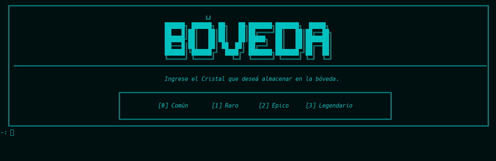
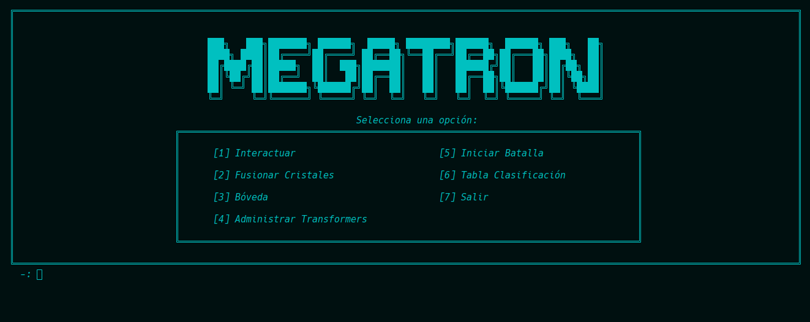

[](https://classroom.github.com/a/SOoPfuVL)
# AYED - TPG 2c2024
### SILVA GUILLERMO ANDRES - 109777 - RIVERO ARDISSONE, CANDELA BELÉN - 110339 - NARVÁEZ YAGUANA, GABRIEL ALEJANDRO - 111432 - 109948 - FARIÑA GONCALVES, ALEX JAVIER  - 112438
<p align="center">
   <br>
</p>


## Compilación

El proyecto se puede compilar manualmente por terminal con la siguiente línea:

```bash
g++ -I include main.cpp src/*.cpp -o main
```

O, alternativamente, con CMake, utilizando el archivo **CMakeLists.txt** presente en el directorio raíz.

## Justificación de la Selección de Estructuras de Datos y Algoritmos.

* ### Cola de Prioridad en el Algoritmo de Camino Mínimo de Dijkstra
  #### ¿Por qué una cola de prioridad?
  * Eficiencia: Encuentra el siguiente nodo a explorar rápidamente.
  * Orden: Mantiene los nodos ordenados por distancia.
  * Optimización: Evita explorar caminos que claramente son más largos.
  * En pocas palabras: En Dijkstra, nos asegura encontrar el camino más corto de manera eficiente, reduciendo la complejidad a O((a + v)log(v)).


## Aclaraciones Adicionales
* ### Obsequio de un Cristal al Iniciar el juego
  * Al iniciarse el juego se obsequiará un cristal de rareza común al jugador 

* ### Parámetro Poder
  * El parámetro de poder de un cristal se representa mediante la suma de las estadísticas de un cristal es decir es la suma entre la fuerza, defensa y velociad.

* ### Funcionalidad para Mostrar el cristal con mayor Poder
  * Para poder mostrar el cristal con mayor poder lo que se decide es ir almacenando en la bóveda los cristales de manera ordenada y asi el obtener el cristal de mayor poder tendrá un costo de O(1), esto porque se ordena de manera descendente lo que permite obtenerlo de una manera más rápida, ya que está en la primera posición.

* ### Funcionalidad para Equipar con un Cristal al Personaje
  * Para poder equipar con un cristal al personaje lo que se decidió es crearle una mini bóveda al personaje en la cual el mismo solo podrá equiparse con 7 cristales.
  * Para la bóveda lo que hicimos es reutilizar la bóveda que teníamos creados, pero esta vez le redujimos la capacidad a solo 7 cristales, esto mediante una sobrecarga en el constructor de la bóveda.


## Imagenes del juego
### Menu de Administrador Transformers


  

| Escoger Facción                                                                  | Pedir Nombre Transformers                                  |
|----------------------------------------------------------------------------------|------------------------------------------------------------|
|  |  |

| Escoger Vehiculo                                                              | Escoger Aeronave                                                               |
|-------------------------------------------------------------------------------|--------------------------------------------------------------------------------|
|  |  |
### Menu de Nuevas Funcionalidades (Fusiondor - Boveda)
| Menu Bóveda                                                               | Menu Fusionador                                                               |
|---------------------------------------------------------------------------|-------------------------------------------------------------------------------|
|  |  |
### Menus de la Bóveda
| Menu Bóveda para Almacenar                                                          | Menu Bóveda para Exportar                                                          |
|-------------------------------------------------------------------------------------|------------------------------------------------------------------------------------|
|  |  |
### Menu de Personajes
| Menu Personaje Optimus                                                     | Menu Personaje Megatron                                                     |
|----------------------------------------------------------------------------|-----------------------------------------------------------------------------|
|  |  |

### Menu para elegir el estado
| Elegir Estados para Optimus                                                         | Elegir Estados para Megatron                                                          |
|-------------------------------------------------------------------------------------|---------------------------------------------------------------------------------------|
|  |  |


### Respuestas que se da a distintos cambios
| Sugerir Fusion                                                                           | Respuesta a mensaje                                                                |
|------------------------------------------------------------------------------------------|------------------------------------------------------------------------------------|
|            |     |
| Modificar Estado                                                                         | Resultado de Fusionar                                                              |
|  |  |


