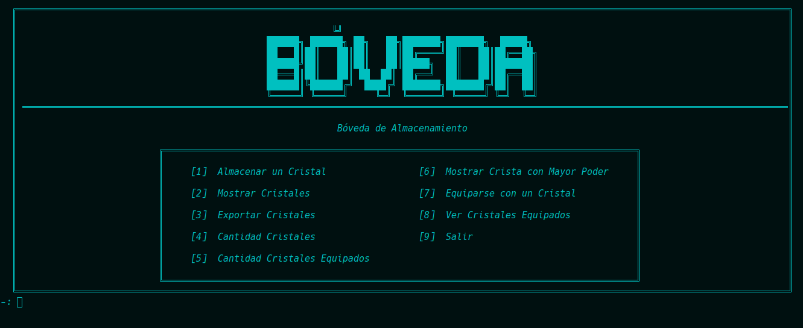
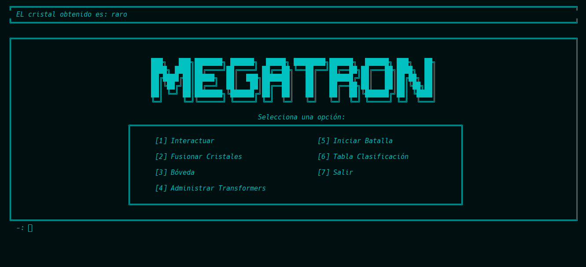

[](https://classroom.github.com/a/SOoPfuVL)
# AYED - TPG 2c2024
### SILVA GUILLERMO ANDRES - 109777 - RIVERO ARDISSONE, CANDELA BELÉN - 110339 - NARVÁEZ YAGUANA, GABRIEL ALEJANDRO - 111432 - ROJAS CALIZAYA, KEVIN EDGARDO - 109948 - FARIÑA GONCALVES, ALEX JAVIER  - 112438
<p align="center">
   <br>
</p>


## Compilación

El proyecto se puede compilar manualmente por terminal con la siguiente línea:

```bash
g++ -I include main.cpp src/*.cpp -o main
```

O, alternativamente, con CMake, utilizando el archivo **CMakeLists.txt** presente en el directorio raíz.

## Aclaraciones adicionales:


## Imagenes del juego
### Menu de Nuevas Funcionalidades (Fusiondor - Boveda)
| Menu Bóveda                                                               | Menu Fusionador                                                               |
|---------------------------------------------------------------------------|-------------------------------------------------------------------------------|
|  |  |
### Menus de la Bóveda
| Menu Bóveda para Almacenar                                                          | Menu Bóveda para Exportar                                                          |
|-------------------------------------------------------------------------------------|------------------------------------------------------------------------------------|
|  |  |
### Menu de Personajes
| Menu Personaje Optimus                                                     | Menu Personaje Megatron                                                     |
|----------------------------------------------------------------------------|-----------------------------------------------------------------------------|
|  |  |

### Menu para elegir el estado
| Elegir Estados para Optimus                                                         | Elegir Estados para Megatron                                                          |
|-------------------------------------------------------------------------------------|---------------------------------------------------------------------------------------|
|  |  |


### Respuestas que se da a distintos cambios
| Sugerir Fusion                                                                           | Respuesta a mensaje                                                                |
|------------------------------------------------------------------------------------------|------------------------------------------------------------------------------------|
|            |     |
| Modificar Estado                                                                         | Resultado de Fusionar                                                              |
|  |  |


